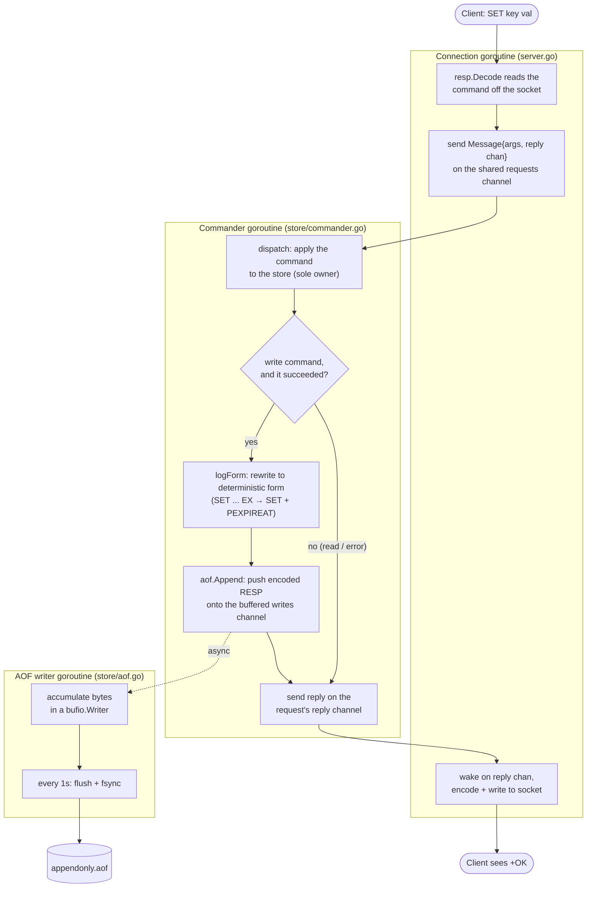

# redis-clone

A Redis server built from scratch in Go.

Unmodified `redis-cli` and `redis-benchmark` connect to it and just work.

```
$ go run .            # listens on :6379

$ redis-cli
127.0.0.1:6379> SET greeting "hello"
OK
127.0.0.1:6379> GET greeting
"hello"
127.0.0.1:6379> RPUSH tasks "write readme" "ship it"
(integer) 2
127.0.0.1:6379> LRANGE tasks 0 -1
1) "write readme"
2) "ship it"
127.0.0.1:6379> ZADD scores 100 alice 85 bob
(integer) 2
127.0.0.1:6379> ZRANGE scores 0 -1 WITHSCORES
1) "bob"
2) "85"
3) "alice"
4) "100"
```

## Why
I decided to work on this project for a couple of reasons:
1. I wanted to work on a different type of project as most of the things I have built are full-stack web applications; Creating a lower level project that operated on TCP and required me to write a serialization protocol sounded like something new and fun.
2. I wanted to improve at writing Go code and become more familiar with concurrency in Go.
3. Redis is something I haven't used much and I thought it would be a good opportunity to get a deeper understanding of how it works.

## Highlights

- **Real wire protocol** — hand-rolled RESP2 encoder/decoder; compatible with standard Redis clients and tools
- **Lock-free concurrency** — one goroutine owns all data; commands flow through channels. Zero mutexes in the codebase
- **Hand-built skiplist** for sorted sets, with rank spans for O(log n) rank and range queries — the same technique real Redis uses
- **Key expiration** done the way Redis does it: lazy expiry on read plus an active background sweep
- **AOF persistence** — configurable fsync policies, log rewrite with atomic file swap, crash-tolerant replay on startup
- **Benchmarked against real Redis** on the same machine — holds ~60% of Redis 8's throughput under load, with the gaps measured and explained below

## How it works

**Concurrency: one owner, no locks.** Every client connection gets its own goroutine, but none of them touch the data. Instead, all commands funnel through a single channel into one *commander* goroutine ([`store/commander.go`](store/commander.go)) that exclusively owns the keyspace. Each request carries its own reply channel, so the connection goroutine just sends a message and waits for the answer. Data races are impossible by construction — there is not a single mutex in the project. The trade-off is two channel hops per command, which is exactly the overhead the benchmarks measure.

**Protocol.** The [`resp`](resp/resp.go) package implements RESP2 (the Redis serialization protocol) from scratch: simple strings, errors, integers, bulk strings, nulls, and nested arrays, decoded incrementally off a buffered socket. The same encoder that writes client replies also writes the persistence log, since an AOF is just a stream of RESP commands.

**Sorted sets.** ZSETs pair a hash map (member → score, for O(1) `ZSCORE`) with a [skiplist](skiplist/skiplist.go) ordered by score. Each skiplist node tracks *spans* — how many elements each forward pointer skips — which is what makes `ZRANK` and index-based `ZRANGE` O(log n) instead of a linear walk. Real Redis uses the same map + skiplist-with-spans combination.

**Expiration.** TTLs work on two tiers, mirroring Redis: every read checks expiry lazily and deletes dead keys on contact, while the commander loop also sweeps a sample of keys every 100ms so unread keys don't linger forever.

**Persistence.** With `-appendonly` enabled, every successful write command is appended to an AOF ([`store/aof.go`](store/aof.go)) in RESP format. Commands are made deterministic before logging — `EXPIRE key 10` becomes `PEXPIREAT key <absolute-ms>` so a replay hours later behaves identically. Under the default `everysec` policy a background writer flushes and fsyncs once a second, off the hot path. `REWRITEAOF` compacts the log by dumping the live dataset as minimal commands into a temp file and atomically renaming it over the old log. On startup, the log is replayed through the same dispatch path clients use, and a truncated tail (e.g. from a crash mid-write) is tolerated.

## Life of a write command (AOF on, `everysec` persistence)

Four goroutines touch a single `SET`. The AOF writer flushes on its own 1-second clock, which is why `everysec` costs nothing in the benchmarks (and why a crash can lose up to the last second of writes):



## Supported commands

| Category | Commands |
|---|---|
| Strings | `SET` (with `EX`/`PX`), `GET`, `INCR`, `DECR` |
| Lists | `LPUSH`, `RPUSH`, `LPOP`, `RPOP`, `LLEN`, `LRANGE` |
| Hashes | `HSET`, `HGET`, `HDEL`, `HGETALL` |
| Sets | `SADD`, `SREM`, `SISMEMBER`, `SMEMBERS`, `SCARD` |
| Sorted sets | `ZADD`, `ZSCORE`, `ZRANGE` (with `WITHSCORES`), `ZRANK`, `ZREM` |
| Keyspace | `DEL`, `EXISTS`, `KEYS`, `EXPIRE`, `TTL`, `PEXPIREAT` |
| Other | `PING`, `ECHO`, `REWRITEAOF` |

## Performance vs. real Redis (details in BENCHMARKS.md)

The clone holds a flat ~60% of Redis at every concurrency level and every payload size, ceilinged at ~135k req/s. That ceiling isn't the data structures (Ex. ZADD into a 63k-member skiplist runs just as fast as GET), it's the fixed cost of the two channel hops and scheduler wakeups per command in the single-commander design. The known levers are batching replies and sharding the store across multiple owner goroutines.

### **The two bad resuts and the causes:**

#### LPUSH

LPUSH ran 20x slower than this server's *own* RPUSH, degrading as the list grew. The cause: lists are plain Go slices, and prepending to a slice means allocating a new one and copying the entire existing list behind the new element. That makes each LPUSH O(n) in list length — and since the benchmark grows the list to 100k elements, O(n²) across the run. Redis avoids this with a quicklist (a doubly-linked list of packed nodes) where both ends are O(1).

**The fix:** replace the slice with a deque — a ring buffer with head/tail indices, or a quicklist-style linked structure — so pushes and pops at both ends are O(1). RPUSH, LPOP, and RPOP already behave well; only left-side insertion hits the copy.

#### AOF `appendfsync always`

With `always`, every write must reach disk before the server replies. The clone does this literally: one fsync per command, executed synchronously inside the single serialized command loop.

Redis uses **group commit**: all commands that arrive during one event-loop iteration are batched into a single write + fsync, so under concurrency one disk flush can cover dozens of commands.

**The fix:** the same idea — drain every request currently waiting in the channel, apply them all, write their log entries in one buffer, fsync once, then send all the replies. Durability is unchanged (no reply is sent before its command is on disk), throughput scales with concurrency.

## Build, run, test

```bash
go build -o redis-clone .

./redis-clone                              # in-memory only, port 6379
./redis-clone -appendonly                  # AOF on, fsync every second
./redis-clone -appendonly -appendfsync always   # fsync every write

go test ./...                              # run the test suite
```

Requires Go 1.26+. No dependencies to install.
